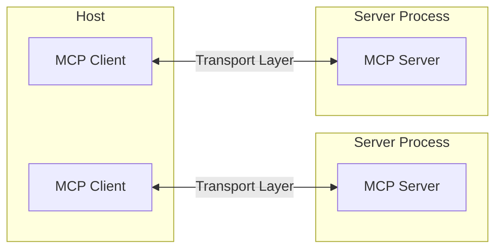
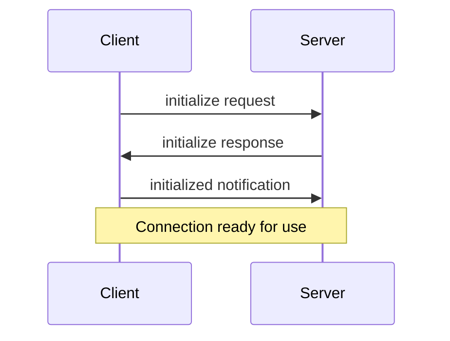

Model Context Protocol (MCP)は、LLMアプリケーションと統合間のシームレスな通信を可能にする柔軟で拡張可能なアーキテクチャを基盤としています。このドキュメントでは、コアとなるアーキテクチャコンポーネントと概念について説明します。

## 概要

MCPはクライアント-サーバーアーキテクチャに従っており：

- **ホスト**は接続を開始するLLMアプリケーション（Claude DesktopやIDEなど）
- **クライアント**はホストアプリケーション内でサーバーと1:1の接続を維持
- **サーバー**はクライアントにコンテキスト、ツール、プロンプトを提供



## コアコンポーネント

### プロトコル層

プロトコル層は、メッセージのフレーミング、リクエスト/レスポンスのリンク、高レベルの通信パターンを処理します。

<Tabs>
  <Tab title="TypeScript">
    ```typescript
    class Protocol<Request, Notification, Result> {
        // Handle incoming requests
        setRequestHandler<T>(schema: T, handler: (request: T, extra: RequestHandlerExtra) => Promise<Result>): void

        // Handle incoming notifications
        setNotificationHandler<T>(schema: T, handler: (notification: T) => Promise<void>): void

        // Send requests and await responses
        request<T>(request: Request, schema: T, options?: RequestOptions): Promise<T>

        // Send one-way notifications
        notification(notification: Notification): Promise<void>
    }
    ```
  </Tab>
  <Tab title="Python">
    ```python
    class Session(BaseSession[RequestT, NotificationT, ResultT]):
        async def send_request(
            self,
            request: RequestT,
            result_type: type[Result]
        ) -> Result:
            """
            Send request and wait for response. Raises McpError if response contains error.
            """
            # Request handling implementation

        async def send_notification(
            self,
            notification: NotificationT
        ) -> None:
            """Send one-way notification that doesn't expect response."""
            # Notification handling implementation

        async def _received_request(
            self,
            responder: RequestResponder[ReceiveRequestT, ResultT]
        ) -> None:
            """Handle incoming request from other side."""
            # Request handling implementation

        async def _received_notification(
            self,
            notification: ReceiveNotificationT
        ) -> None:
            """Handle incoming notification from other side."""
            # Notification handling implementation
    ```
  </Tab>
</Tabs>

主要なクラス：

* `Protocol`
* `Client`
* `Server`

### トランスポート層

トランスポート層は、クライアントとサーバー間の実際の通信を処理します。MCPは複数のトランスポートメカニズムをサポートしています：

1. **Stdioトランスポート**
   - 通信に標準入出力を使用
   - ローカルプロセスに最適

2. **HTTP with SSEトランスポート**
   - サーバーからクライアントへのメッセージにServer-Sent Eventsを使用
   - クライアントからサーバーへのメッセージにHTTP POSTを使用

すべてのトランスポートは[JSON-RPC](https://www.jsonrpc.org/) 2.0を使用してメッセージを交換します。詳細なメッセージフォーマットについては[仕様](https://spec.modelcontextprotocol.io)を参照してください。

### メッセージタイプ

MCPには以下の主要なメッセージタイプがあります：

1. **リクエスト**は相手からのレスポンスを期待します：
    ```typescript
    interface Request {
      method: string;
      params?: { ... };
    }
    ```

2. **結果**はリクエストに対する成功レスポンスです：
    ```typescript
    interface Result {
      [key: string]: unknown;
    }
    ```

3. **エラー**はリクエストが失敗したことを示します：
    ```typescript
    interface Error {
      code: number;
      message: string;
      data?: unknown;
    }
    ```

4. **通知**はレスポンスを期待しない一方向メッセージです：
    ```typescript
    interface Notification {
      method: string;
      params?: { ... };
    }
    ```

## 接続ライフサイクル

### 1. 初期化



1. クライアントがプロトコルバージョンと機能を含む`initialize`リクエストを送信
2. サーバーが自身のプロトコルバージョンと機能で応答
3. クライアントが確認として`initialized`通知を送信
4. 通常のメッセージ交換が開始

### 2. メッセージ交換

初期化後、以下のパターンがサポートされます：

- **リクエスト-レスポンス**：クライアントまたはサーバーがリクエストを送信、相手が応答
- **通知**：どちらかが一方向メッセージを送信

### 3. 終了

どちらかの当事者が接続を終了できます：
- `close()`によるクリーンシャットダウン
- トランスポートの切断
- エラー状態

## エラーハンドリング

MCPは以下の標準エラーコードを定義しています：

```typescript
enum ErrorCode {
  // Standard JSON-RPC error codes
  ParseError = -32700,
  InvalidRequest = -32600,
  MethodNotFound = -32601,
  InvalidParams = -32602,
  InternalError = -32603
}
```

SDKとアプリケーションは-32000以上の独自のエラーコードを定義できます。

エラーは以下を通じて伝播します：
- リクエストに対するエラーレスポンス
- トランスポートのエラーイベント
- プロトコルレベルのエラーハンドラ

## 実装例

基本的なMCPサーバーの実装例：

<Tabs>
  <Tab title="TypeScript">
    ```typescript
    import { Server } from "@modelcontextprotocol/sdk/server/index.js";
    import { StdioServerTransport } from "@modelcontextprotocol/sdk/server/stdio.js";

    const server = new Server({
      name: "example-server",
      version: "1.0.0"
    }, {
      capabilities: {
        resources: {}
      }
    });

    // Handle requests
    server.setRequestHandler(ListResourcesRequestSchema, async () => {
      return {
        resources: [
          {
            uri: "example://resource",
            name: "Example Resource"
          }
        ]
      };
    });

    // Connect transport
    const transport = new StdioServerTransport();
    await server.connect(transport);
    ```
  </Tab>
  <Tab title="Python">
    ```python
    import asyncio
    import mcp.types as types
    from mcp.server import Server
    from mcp.server.stdio import stdio_server

    app = Server("example-server")

    @app.list_resources()
    async def list_resources() -> list[types.Resource]:
        return [
            types.Resource(
                uri="example://resource",
                name="Example Resource"
            )
        ]

    async def main():
        async with stdio_server() as streams:
            await app.run(
                streams[0],
                streams[1],
                app.create_initialization_options()
            )

    if __name__ == "__main__":
        asyncio.run(main())
    ```
  </Tab>
</Tabs>

## ベストプラクティス

### トランスポート選択

1. **ローカル通信**
   - ローカルプロセスにはstdioトランスポートを使用
   - 同一マシン通信に効率的
   - シンプルなプロセス管理

2. **リモート通信**
   - HTTP互換性が必要なシナリオではSSEを使用
   - 認証と認可を含むセキュリティ影響を考慮

### メッセージハンドリング

1. **リクエスト処理**
   - 入力を徹底的に検証
   - タイプセーフなスキーマを使用
   - エラーを適切に処理
   - タイムアウトを実装

2. **進捗報告**
   - 長時間操作には進捗トークンを使用
   - 増分的に進捗を報告
   - 総進捗が分かっている場合は含める

3. **エラー管理**
   - 適切なエラーコードを使用
   - 役立つエラーメッセージを含める
   - エラー時にリソースをクリーンアップ

## セキュリティ考慮事項

1. **トランスポートセキュリティ**
   - リモート接続にはTLSを使用
   - 接続元を検証
   - 必要に応じて認証を実装

2. **メッセージ検証**
   - 受信メッセージをすべて検証
   - 入力をサニタイズ
   - メッセージサイズ制限をチェック
   - JSON-RPCフォーマットを検証

3. **リソース保護**
   - アクセス制御を実装
   - リソースパスを検証
   - リソース使用を監視
   - リクエストをレート制限

4. **エラーハンドリング**
   - 機密情報を漏らさない
   - セキュリティ関連のエラーをログ
   - 適切なクリーンアップを実装
   - DoSシナリオを処理

## デバッグとモニタリング

1. **ロギング**
   - プロトコルイベントをログ
   - メッセージフローを追跡
   - パフォーマンスを監視
   - エラーを記録

2. **診断**
   - ヘルスチェックを実装
   - 接続状態を監視
   - リソース使用を追跡
   - パフォーマンスをプロファイリング

3. **テスト**
   - 異なるトランスポートをテスト
   - エラーハンドリングを検証
   - エッジケースをチェック
   - サーバーを負荷テスト
