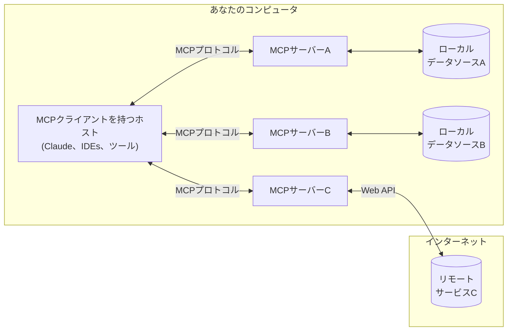

<Note>C# SDKがリリースされました！[最新情報](/development/updates)をチェックしてください</Note>

MCPは、アプリケーションがLLMにコンテキストを提供する方法を標準化するオープンプロトコルです。MCPはAIアプリケーションのためのUSB-Cポートのようなものと考えてください。USB-Cがデバイスを様々な周辺機器やアクセサリに接続する標準化された方法を提供するように、MCPはAIモデルを異なるデータソースやツールに接続する標準化された方法を提供します。

## MCPの利点

MCPはLLM上にエージェントや複雑なワークフローを構築するのに役立ちます。LLMは頻繁にデータやツールとの統合を必要とし、MCPは以下を提供します:
- LLMが直接接続できる事前構築済みの統合の増え続けるリスト
- LLMプロバイダーやベンダー間で切り替える柔軟性
- インフラストラクチャ内でデータを保護するためのベストプラクティス

### 一般的なアーキテクチャ

コアとなるのは、MCPがホストアプリケーションが複数のサーバーに接続できるクライアント-サーバーアーキテクチャに従っていることです:

- **MCPホスト**: Claude Desktop、IDE、またはMCPを通じてデータにアクセスしたいAIツールなどのプログラム
- **MCPクライアント**: サーバーと1:1の接続を維持するプロトコルクライアント
- **MCPサーバー**: 標準化されたModel Context Protocolを通じて特定の機能を公開する軽量プログラム
- **ローカルデータソース**: MCPサーバーが安全にアクセスできるコンピュータのファイル、データベース、サービス
- **リモートサービス**: MCPサーバーが接続できるインターネット経由の外部システム（例: API経由）

## はじめましょう

あなたのニーズに最適なパスを選択してください:

#### クイックスタート
<CardGroup cols={2}>
  <Card
    title="サーバー開発者向け"
    icon="bolt"
    href="/quickstart/server"
  >
    Claude for Desktopや他のクライアントで使用する独自のサーバー構築を開始
  </Card>
  <Card
    title="クライアント開発者向け"
    icon="bolt"
    href="/quickstart/client"
  >
    すべてのMCPサーバーと統合できる独自のクライアント構築を開始
  </Card>
  <Card
    title="Claude Desktopユーザー向け"
    icon="bolt"
    href="/quickstart/user"
  >
    Claude for Desktopで事前構築済みサーバーの使用を開始
  </Card>
</CardGroup>

#### 例
<CardGroup cols={2}>
  <Card
    title="サーバー例"
    icon="grid"
    href="/examples"
  >
    公式MCPサーバーと実装のギャラリーをチェック
  </Card>
  <Card
    title="クライアント例"
    icon="cubes"
    href="/clients"
  >
    MCP統合をサポートするクライアントのリストを表示
  </Card>
</CardGroup>

## チュートリアル

<CardGroup cols={2}>
  <Card
    title="LLMを使ったMCP構築"
    icon="comments"
    href="/tutorials/building-mcp-with-llms"
  >
    ClaudeのようなLLMを使用してMCP開発を加速する方法を学ぶ
  </Card>
  <Card
  title="デバッグガイド"
  icon="bug"
  href="/docs/tools/debugging">
    MCPサーバーと統合を効果的にデバッグする方法を学ぶ
  </Card>
  <Card
    title="MCPインスペクター"
    icon="magnifying-glass"
    href="/docs/tools/inspector"
  >
    インタラクティブなデバッグツールでMCPサーバーをテスト・検査
  </Card>
  <Card
    title="MCPワークショップ（動画、2時間）"
    icon="person-chalkboard"
    href="https://www.youtube.com/watch?v=kQmXtrmQ5Zg"
  >
    <iframe src="https://www.youtube.com/embed/kQmXtrmQ5Zg"> </iframe>
  </Card>
</CardGroup>

## MCPを探る

MCPのコアコンセプトと機能についてさらに深く掘り下げましょう:

<CardGroup cols={2}>
  <Card
    title="コアアーキテクチャ"
    icon="sitemap"
    href="/docs/concepts/architecture"
  >
    クライアント、サーバー、LLMをMCPがどのように接続するかを理解
  </Card>
  <Card
    title="リソース"
    icon="database"
    href="/docs/concepts/resources"
  >
    サーバーからLLMにデータとコンテンツを公開
  </Card>
  <Card
    title="プロンプト"
    icon="message"
    href="/docs/concepts/prompts"
  >
    再利用可能なプロンプトテンプレートとワークフローを作成
  </Card>
  <Card
    title="ツール"
    icon="wrench"
    href="/docs/concepts/tools"
  >
    LLMがサーバーを通じてアクションを実行できるようにする
  </Card>
  <Card
    title="サンプリング"
    icon="robot"
    href="/docs/concepts/sampling"
  >
    サーバーがLLMから補完をリクエストできるようにする
  </Card>
  <Card
    title="トランスポート"
    icon="network-wired"
    href="/docs/concepts/transports"
  >
    MCPの通信メカニズムについて学ぶ
  </Card>
</CardGroup>

## 貢献

貢献したいですか？[貢献ガイド](/development/contributing)をチェックして、MCPの改善にどのように役立てられるかを学んでください。

## サポートとフィードバック

以下はヘルプを求めたりフィードバックを提供する方法です:

- MCP仕様、SDK、またはドキュメント（オープンソース）に関連するバグレポートや機能リクエストについては、[GitHubイシューを作成](https://github.com/modelcontextprotocol)してください
- MCP仕様に関するディスカッションやQ&Aについては、[仕様ディスカッション](https://github.com/modelcontextprotocol/specification/discussions)を使用してください
- 他のMCPオープンソースコンポーネントに関するディスカッションやQ&Aについては、[組織ディスカッション](https://github.com/orgs/modelcontextprotocol/discussions)を使用してください
- Claude.appとclaude.aiのMCP統合に関するバグレポート、機能リクエスト、質問については、Anthropicの[サポートの受け方](https://support.anthropic.com/en/articles/9015913-how-to-get-support)ガイドをご覧ください
