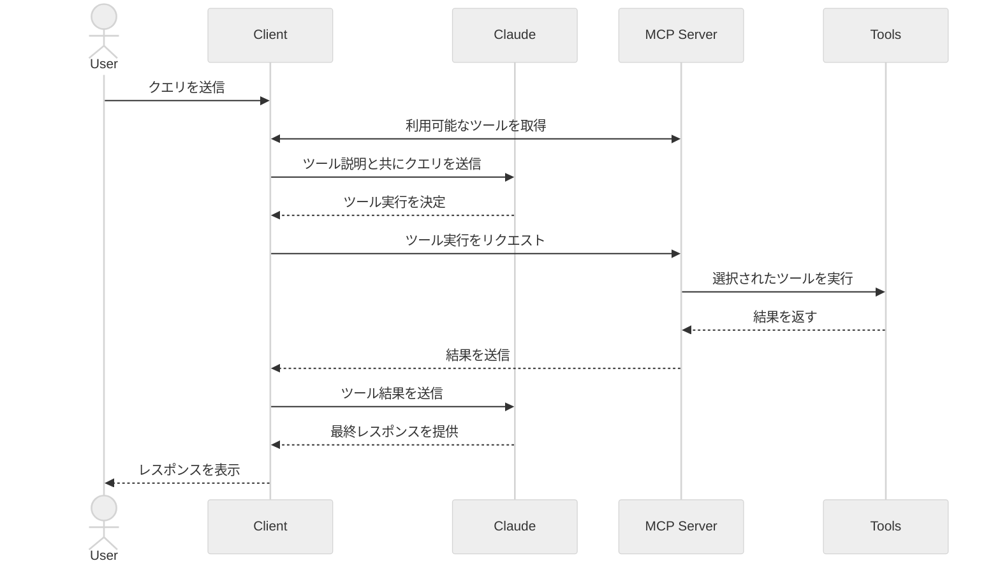

[翻訳済み]

<Tab title="Python">

[このチュートリアルの完全なコードはこちらから確認できます](https://github.com/modelcontextprotocol/quickstart-resources/tree/main/mcp-client-python)

## システム要件

開始前に、以下のシステム要件を満たしていることを確認してください:
- MacまたはWindowsコンピュータ
- 最新バージョンのPythonがインストールされていること
- 最新バージョンの`uv`がインストールされていること

## 環境設定

まず、`uv`を使用して新しいPythonプロジェクトを作成します:

```bash
# プロジェクトディレクトリを作成
uv init mcp-client
cd mcp-client

# 仮想環境を作成
uv venv

# 仮想環境をアクティベート
# Windowsの場合:
.venv\Scripts\activate
# UnixまたはMacOSの場合:
source .venv/bin/activate

# 必要なパッケージをインストール
uv add mcp anthropic python-dotenv

# ボイラープレートファイルを削除
rm main.py

# メインファイルを作成
touch client.py
```

## APIキーの設定

[Anthropic Console](https://console.anthropic.com/settings/keys)からAnthropic APIキーを取得する必要があります。

.envファイルを作成してキーを保存します:

```bash
# .envファイルを作成
touch .env
```

.envファイルにキーを追加:
```bash
ANTHROPIC_API_KEY=<your key here>
```

.gitignoreに.envを追加:
```bash
echo ".env" >> .gitignore
```

<Warning>
`ANTHROPIC_API_KEY`は安全に保管してください！
</Warning>

## クライアントの作成

### 基本的なクライアント構造
まず、インポートと基本的なクライアントクラスを設定します:

```python
import asyncio
from typing import Optional
from contextlib import AsyncExitStack

from mcp import ClientSession, StdioServerParameters
from mcp.client.stdio import stdio_client

from anthropic import Anthropic
from dotenv import load_dotenv

load_dotenv()  # .envから環境変数を読み込み

class MCPClient:
    def __init__(self):
        # セッションとクライアントオブジェクトを初期化
        self.session: Optional[ClientSession] = None
        self.exit_stack = AsyncExitStack()
        self.anthropic = Anthropic()
    # メソッドはここに追加
```

### サーバー接続管理

次に、MCPサーバーに接続するメソッドを実装します:

```python
async def connect_to_server(self, server_script_path: str):
    """MCPサーバーに接続します

    Args:
        server_script_path: サーバースクリプトのパス (.py または .js)
    """
    is_python = server_script_path.endswith('.py')
    is_js = server_script_path.endswith('.js')
    if not (is_python or is_js):
        raise ValueError("サーバースクリプトは.pyまたは.jsファイルである必要があります")

    command = "python" if is_python else "node"
    server_params = StdioServerParameters(
        command=command,
        args=[server_script_path],
        env=None
    )

    stdio_transport = await self.exit_stack.enter_async_context(stdio_client(server_params))
    self.stdio, self.write = stdio_transport
    self.session = await self.exit_stack.enter_async_context(ClientSession(self.stdio, self.write))

    await self.session.initialize()

    # 利用可能なツールをリストアップ
    response = await self.session.list_tools()
    tools = response.tools
    print("\nサーバーに接続しました。利用可能なツール:", [tool.name for tool in tools])
```

### クエリ処理ロジック

クエリを処理し、ツール呼び出しを処理するコア機能を追加します:

```python
async def process_query(self, query: str) -> str:
    """Claudeと利用可能なツールを使用してクエリを処理します"""
    messages = [
        {
            "role": "user",
            "content": query
        }
    ]

    response = await self.session.list_tools()
    available_tools = [{
        "name": tool.name,
        "description": tool.description,
        "input_schema": tool.inputSchema
    } for tool in response.tools]

    # Claude APIの初期呼び出し
    response = self.anthropic.messages.create(
        model="claude-3-5-sonnet-20241022",
        max_tokens=1000,
        messages=messages,
        tools=available_tools
    )

    # レスポンスを処理し、ツール呼び出しを処理
    final_text = []

    assistant_message_content = []
    for content in response.content:
        if content.type == 'text':
            final_text.append(content.text)
            assistant_message_content.append(content)
        elif content.type == 'tool_use':
            tool_name = content.name
            tool_args = content.input

            # ツール呼び出しを実行
            result = await self.session.call_tool(tool_name, tool_args)
            final_text.append(f"[ツール {tool_name} を引数 {tool_args} で呼び出し中]")

            assistant_message_content.append(content)
            messages.append({
                "role": "assistant",
                "content": assistant_message_content
            })
            messages.append({
                "role": "user",
                "content": [
                    {
                        "type": "tool_result",
                        "tool_use_id": content.id,
                        "content": result.content
                    }
                ]
            })

            # Claudeから次のレスポンスを取得
            response = self.anthropic.messages.create(
                model="claude-3-5-sonnet-20241022",
                max_tokens=1000,
                messages=messages,
                tools=available_tools
            )

            final_text.append(response.content[0].text)

    return "\n".join(final_text)
```

### インタラクティブチャットインターフェース
チャットループとクリーンアップ機能を追加します:

```python
async def chat_loop(self):
    """インタラクティブなチャットループを実行します"""
    print("\nMCPクライアントが起動しました！")
    print("クエリを入力するか、'quit'で終了します。")

    while True:
        try:
            query = input("\nクエリ: ").strip()

            if query.lower() == 'quit':
                break

            response = await self.process_query(query)
            print("\n" + response)

        except Exception as e:
            print(f"\nエラー: {str(e)}")

async def cleanup(self):
    """リソースをクリーンアップします"""
    await self.exit_stack.aclose()
```

### メインエントリーポイント

最後に、メイン実行ロジックを追加します:

```python
async def main():
    if len(sys.argv) < 2:
        print("使用方法: python client.py <サーバースクリプトのパス>")
        sys.exit(1)

    client = MCPClient()
    try:
        await client.connect_to_server(sys.argv[1])
        await client.chat_loop()
    finally:
        await client.cleanup()

if __name__ == "__main__":
    import sys
    asyncio.run(main())
```

完全な`client.py`ファイルは[こちら](https://gist.github.com/zckly/f3f28ea731e096e53b39b47bf0a2d4b1)から確認できます。

## 主要コンポーネントの説明

### 1. クライアント初期化
- `MCPClient`クラスはセッション管理とAPIクライアントで初期化されます
- 適切なリソース管理のために`AsyncExitStack`を使用します
- Claudeとの連携のためにAnthropicクライアントを設定します

### 2. サーバー接続
- PythonとNode.jsサーバーの両方をサポートします
- サーバースクリプトの種類を検証します
- 適切な通信チャネルを設定します
- セッションを初期化し、利用可能なツールをリストアップします

### 3. クエリ処理
- 会話のコンテキストを維持します
- Claudeのレスポンスとツール呼び出しを処理します
- Claudeとツール間のメッセージフローを管理します
- 結果を一貫性のあるレスポンスに結合します

### 4. インタラクティブインターフェース
- シンプルなコマンドラインインターフェースを提供します
- ユーザー入力とレスポンス表示を処理します
- 基本的なエラーハンドリングを含みます
- グレースフルな終了を可能にします

### 5. リソース管理
- リソースの適切なクリーンアップ
- 接続問題のエラーハンドリング
- グレースフルなシャットダウンプロシージャ

## 一般的なカスタマイズポイント

1. **ツール処理**
   - 特定のツールタイプを処理するために`process_query()`を変更します
   - ツール呼び出しのカスタムエラーハンドリングを追加します
   - ツール固有のレスポンスフォーマットを実装します

2. **レスポンス処理**
   - ツール結果のフォーマット方法をカスタマイズします
   - レスポンスフィルタリングや変換を追加します
   - カスタムロギングを実装します

3. **ユーザーインターフェース**
   - GUIやWebインターフェースを追加します
   - リッチコンソール出力を実装します
   - コマンド履歴やオートコンプリートを追加します

## クライアントの実行

任意のMCPサーバーでクライアントを実行します:

```bash
uv run client.py path/to/server.py # Pythonサーバー
uv run client.py path/to/build/index.js # Nodeサーバー
```

<Note>
サーバークイックスタートの天気チュートリアルを続ける場合、コマンドは次のようになります: `python client.py .../quickstart-resources/weather-server-python/weather.py`
</Note>

クライアントは以下のことを行います:
1. 指定されたサーバーに接続します
2. 利用可能なツールをリストアップします
3. インタラクティブなチャットセッションを開始します:
   - クエリを入力できます
   - ツールの実行を確認できます
   - Claudeからのレスポンスを取得できます

サーバークイックスタートの天気サーバーに接続した場合の例:

<Frame>
  
</Frame>

## 動作の仕組み

クエリを送信すると:

1. クライアントはサーバーから利用可能なツールのリストを取得します
2. クエリがツールの説明と共にClaudeに送信されます
3. Claudeは使用するツール(ある場合)を決定します
4. クライアントはサーバーを通じて要求されたツール呼び出しを実行します
5. 結果がClaudeに送り返されます
6. Claudeは自然言語のレスポンスを提供します
7. レスポンスが表示されます

## ベストプラクティス

1. **エラーハンドリング**
   - ツール呼び出しは常にtry-catchブロックで囲みます
   - 意味のあるエラーメッセージを提供します
   - 接続問題を適切に処理します

2. **リソース管理**
   - 適切なクリーンアップのために`AsyncExitStack`を使用します
   - 終了時に接続を閉じます
   - サーバーの切断を処理します

3. **セキュリティ**
   - APIキーは安全に.envに保管します
   - サーバーのレスポンスを検証します
   - ツールの権限には注意します

## トラブルシューティング

### サーバーパス問題
- サーバースクリプトへのパスを再確認します
- 相対パスが機能しない場合は絶対パスを使用します
- Windowsユーザーはフォワードスラッシュ(/)またはエスケープされたバックスラッシュ(\\)を使用します
- サーバーファイルの拡張子が正しいことを確認します(.py for Pythonまたは.js for Node.js)

正しいパス使用例:
```bash
# 相対パス
uv run client.py ./server/weather.py

# 絶対パス
uv run client.py /Users/username/projects/mcp-server/weather.py

# Windowsパス(どちらの形式でも動作)
uv run client.py C:/projects/mcp-server/weather.py
uv run client.py C:\\projects\\mcp-server\\weather.py
```

### レスポンスタイミング
- 最初のレスポンスには最大30秒かかる場合があります
- これは以下の処理中に正常に発生します:
  - サーバーの初期化
  - Claudeによるクエリ処理
  - ツールの実行
- 後続のレスポンスは通常より高速です
- この初期待機中にプロセスを中断しないでください

### 一般的なエラーメッセージ

以下のエラーが表示された場合:
- `FileNotFoundError`: サーバーパスを確認します
- `Connection refused`: サーバーが実行中でパスが正しいことを確認します
- `Tool execution failed`: ツールの必要な環境変数が設定されていることを確認します
- `Timeout error`: クライアント設定でタイムアウトを増やすことを検討します

</Tab>

<Tab title="Kotlin">

[このチュートリアルの完全なコードはこちらから確認できます](https://github.com/modelcontextprotocol/kotlin-sdk/tree/main/samples/kotlin-mcp-client)

## システム要件

開始前に、以下のシステム要件を満たしていることを確認してください:
- Java 17以上
- Anthropic APIキー(Claude用)

## 環境設定

まず、`java`と`gradle`をインストールします（まだインストールしていない場合）。
[公式Oracle JDKウェブサイト](https://www.oracle.com/java/technologies/downloads/)から`java`をダウンロードできます。
`java`のインストールを確認します:
```bash
java --version
```

次に、プロジェクトを作成して設定します:

<CodeGroup>
```bash MacOS/Linux
# プロジェクトディレクトリを作成
mkdir kotlin-mcp-client
cd kotlin-mcp-client

# 新しいKotlinプロジェクトを初期化
gradle init
```

```powershell Windows
# プロジェクトディレクトリを作成
md kotlin-mcp-client
cd kotlin-mcp-client
# 新しいKotlinプロジェクトを初期化
gradle init
```
</CodeGroup>

`gradle init`を実行すると、プロジェクト作成のオプションが表示されます。
プロジェクトタイプとして**Application**、プログラミング言語として**Kotlin**、Javaバージョンとして**Java 17**を選択してください。

または、[IntelliJ IDEAプロジェクトウィザード](https://kotlinlang.org/docs/jvm-get-started.html)を使用してKotlinアプリケーションを作成することもできます。

プロジェクトを作成したら、以下の依存関係を追加します:

<CodeGroup>
```kotlin build.gradle.kts
val mcpVersion = "0.4.0"
val slf4jVersion = "2.0.9"
val anthropicVersion = "0.8.0"

dependencies {
    implementation("io.modelcontextprotocol:kotlin-sdk:$mcpVersion")
    implementation("org.slf4j:slf4j-nop:$slf4jVersion")
    implementation("com.anthropic:anthropic-java:$anthropicVersion")
}
```

```groovy build.gradle
def mcpVersion = '0.3.0'
def slf4jVersion = '2.0.9'
def anthropicVersion = '0.8.0'
dependencies {
    implementation "io.modelcontextprotocol:kotlin-sdk:$mcpVersion"
    implementation "org.slf4j:slf4j-nop:$slf4jVersion"
    implementation "com.anthropic:anthropic-java:$anthropicVersion"
}
```
</CodeGroup>

また、ビルドスクリプトに以下のプラグインを追加します:
<CodeGroup>
```kotlin build.gradle.kts
plugins {
    id("com.github.johnrengelman.shadow") version "8.1.1"
}
```

```groovy build.gradle
plugins {
    id 'com.github.johnrengelman.shadow' version '8.1.1'
}
```
</CodeGroup>

## APIキーの設定

[Anthropic Console](https://console.anthropic.com/settings/keys)からAnthropic APIキーを取得する必要があります。

APIキーを設定します:
```bash
export ANTHROPIC_API_KEY='your-anthropic-api-key-here'
```

<Warning>
`ANTHROPIC_API_KEY`は安全に保管してください！
</Warning>

## クライアントの作成

### 基本的なクライアント構造

まず、基本的なクライアントクラスを作成します:

```kotlin
class MCPClient : AutoCloseable {
    private val anthropic = AnthropicOkHttpClient.fromEnv()
    private val mcp: Client = Client(clientInfo = Implementation(name = "mcp-client-cli", version = "1.0.0"))
    private lateinit var tools: List<ToolUnion>

    // メソッドはここに追加

    override fun close() {
        runBlocking {
            mcp.close()
            anthropic.close()
        }
    }
```

### サーバー接続管理

次に、MCPサーバーに接続するメソッドを実装します:

```kotlin
suspend fun connectToServer(serverScriptPath: String) {
    try {
        val command = buildList {
            when (serverScriptPath.substringAfterLast(".")) {
                "js" -> add("node")
                "py" -> add(if (System.getProperty("os.name").lowercase().contains("win")) "python" else "python3")
                "jar" -> addAll(listOf("java", "-jar"))
                else -> throw IllegalArgumentException("サーバースクリプトは.js、.pyまたは.jarファイルである必要があります")
            }
            add(serverScriptPath)
        }

        val process = ProcessBuilder(command).start()
        val transport = StdioClientTransport(
            input = process.inputStream.asSource().buffered(),
            output = process.outputStream.asSink().buffered()
        )

        mcp.connect(transport)

        val toolsResult = mcp.listTools()
        tools = toolsResult?.tools?.map { tool ->
            ToolUnion.ofTool(
                Tool.builder()
                    .name(tool.name)
                    .description(tool.description ?: "")
                    .inputSchema(
                        Tool.InputSchema.builder()
                            .type(JsonValue.from(tool.inputSchema.type))
                            .properties(tool.inputSchema.properties.toJsonValue())
                            .putAdditionalProperty("required", JsonValue.from(tool.inputSchema.required))
                            .build()
                    )
                    .build()
            )
        } ?: emptyList()
        println("サーバーに接続しました。利用可能なツール: ${tools.joinToString(", ") { it.tool().get().name() }}")
    } catch (e: Exception) {
        println("MCPサーバーへの接続に失敗しました: $e")
        throw e
    }
}
```

また、Anthropic用に`JsonObject`から`JsonValue`に変換するヘルパー関数を作成します:
```kotlin
private fun JsonObject.toJsonValue(): JsonValue {
    val mapper = ObjectMapper()
    val node = mapper.readTree(this.toString())
    return JsonValue.fromJsonNode(node)
}
```

### クエリ処理ロジック

クエリを処理し、ツール呼び出しを処理するコア機能を追加します:

```kotlin
private val messageParamsBuilder: MessageCreateParams.Builder = MessageCreateParams.builder()
    .model(Model.CLAUDE_3_5_SONNET_20241022)
    .maxTokens(1024)

suspend fun processQuery(query: String): String {
    val messages = mutableListOf(
        MessageParam.builder()
            .role(MessageParam.Role.USER)
            .content(query)
            .build()
    )

    val response = anthropic.messages().create(
        messageParamsBuilder
            .messages(messages)
            .tools(tools)
            .build()
    )

    val finalText = mutableListOf<String>()
    response.content().forEach { content ->
        when {
            content.isText() -> finalText.add(content.text().getOrNull()?.text() ?: "")

            content.isToolUse() -> {
                val toolName = content.toolUse().get().name()
                val toolArgs =
                    content.toolUse().get()._input().convert(object : TypeReference<Map<String, JsonValue>>() {})

                val result = mcp.callTool(
                    name = toolName,
                    arguments = toolArgs ?: emptyMap()
                )
                finalText.add("[ツール $toolName を引数 $toolArgs で呼び出し中]")

                messages.add(
                    MessageParam.builder()
                        .role(MessageParam.Role.USER)
                        .content(
                            """
                                "type": "tool_result",
                                "tool_name": $toolName,
                                "result": ${result?.content?.joinToString("\n") { (it as TextContent).text ?: "" }}
                            """.trimIndent()
                        )
                        .build()
                )

                val aiResponse = anthropic.messages().create(
                    messageParamsBuilder
                        .messages(messages)
                        .build()
                )

                finalText.add(aiResponse.content().first().text().getOrNull()?.text() ?: "")
            }
        }
    }

    return finalText.joinToString("\n", prefix = "", postfix = "")
}
```

### インタラクティブチャット

チャットループを追加します:

```kotlin
suspend fun chatLoop() {
    println("\nMCPクライアントが起動しました！")
    println("クエリを入力するか、'quit'で終了します。")

    while (true) {
        print("\nクエリ: ")
        val message = readLine() ?: break
        if (message.lowercase() == "quit") break
        val response = processQuery(message)
        println("\n$response")
    }
}
```

### メインエントリーポイント

最後に、メイン実行関数を追加します:

```kotlin
fun main(args: Array<String>) = runBlocking {
    if (args.isEmpty()) throw IllegalArgumentException("使用方法: java -jar <your_path>/build/libs/kotlin-mcp-client-0.1.0-all.jar <サーバースクリプトのパス>")
    val serverPath = args.first()
    val client = MCPClient()
    client.use {
        client.connectToServer(serverPath)
        client.chatLoop()
    }
}
```

## クライアントの実行

任意のMCPサーバーでクライアントを実行します:

```bash
./gradlew build

# クライアントを実行
java -jar build/libs/<your-jar-name>.jar path/to/server.jar # jvmサーバー
java -jar build/libs/<your-jar-name>.jar path/to/server.py # pythonサーバー
java -jar build/libs/<your-jar-name>.jar path/to/build/index.js # nodeサーバー
```

<Note>
サーバークイックスタートの天気チュートリアルを続ける場合、コマンドは次のようになります: `java -jar build/libs/kotlin-mcp-client-0.1.0-all.jar .../samples/weather-stdio-server/build/libs/weather-stdio-server-0.1.0-all.jar`
</Note>

**クライアントは以下のことを行います:**
1. 指定されたサーバーに接続します
2. 利用可能なツールをリストアップします
3. インタラクティブなチャットセッションを開始します:
   - クエリを入力できます
   - ツールの実行を確認できます
   - Claudeからのレスポンスを取得できます

## 動作の仕組み

以下は高レベルのワークフロー図です:



クエリを送信すると:
1. クライアントはサーバーから利用可能なツールのリストを取得します
2. クエリがツールの説明と共にClaudeに送信されます
3. Claudeは使用するツール(ある場合)を決定します
4. クライアントはサーバーを通じて要求されたツール呼び出しを実行します
5. 結果がClaudeに送り返されます
6. Claudeは自然言語のレスポンスを提供します
7. レスポンスが表示されます

## ベストプラクティス

1. **エラーハンドリング**
   - Kotlinの型システムを活用してエラーを明示的にモデル化します
   - 例外が発生する可能性がある外部ツールやAPI呼び出しを`try-catch`ブロックで囲みます
   - 明確で意味のあるエラーメッセージを提供します
   - ネットワークタイムアウトや接続問題を適切に処理します

2. **セキュリティ**
   - APIキーやシークレットは`local.properties`、環境変数、またはシークレットマネージャーに安全に保管します
   - 予期しないまたは安全でないデータ使用を避けるために、すべての外部レスポンスを検証します
   - ツールを使用する際は、権限と信頼境界に注意します

## トラブルシューティング

### サーバーパス問題
- サーバースクリプトへのパスを再確認します
- 相対パスが機能しない場合は絶対パスを使用します
- Windowsユーザーはフォワードスラッシュ(/)またはエスケープされたバックスラッシュ(\\)を使用します
- 必要なランタイムがインストールされていることを確認します（Javaの場合はjava、Node.jsの場合はnpm、Pythonの場合はuv）
- サーバーファイルの拡張子が正しいことを確認します（Javaの場合は.jar、Node.jsの場合は.js、Pythonの場合は.py）

正しいパス使用例:
```bash
# 相対パス
java -jar build/libs/client.jar ./server/build/libs/server.jar

# 絶対パス
java -jar build/libs/client.jar /Users/username/projects/mcp-server/build/libs/server.jar

# Windowsパス(どちらの形式でも動作)
java -jar build/libs/client.jar C:/projects/mcp-server/build/libs/server.jar
java -jar build/libs/client.jar C:\\projects\\mcp-server\\build\\libs\\server.jar
```

### レスポンスタイミング
- 最初のレスポンスには最大30秒かかる場合があります
- これは以下の処理中に正常に発生します:
  - サーバーの初期化
  - Claudeによるクエリ処理
  - ツールの実行
- 後続のレスポンスは通常より高速です
- この初期待機中にプロセスを中断しないでください

### 一般的なエラーメッセージ

以下のエラーが表示された場合:
- `Connection refused`: サーバーが実行中でパスが正しいことを確認します
- `Tool execution failed`: ツールの必要な環境変数が設定されていることを確認します
- `ANTHROPIC_API_KEY is not set`: 環境変数を確認します

</Tab>

<Tab title="Java">

<Note>
これはSpring AI MCP自動設定とブートスターターに基づくクイックスタートデモです。
手動で同期/非同期MCPクライアントを作成する方法については、[Java SDKクライアント](/sdk/java/mcp-client)ドキュメントを参照してください
</Note>

この例では、Spring AIのModel Context Protocol (MCP)と[Brave Search MCP Server](https://github.com/modelcontextprotocol/servers/tree/main/src/brave-search)を組み合わせた対話型チャットボットの構築方法を示します。このアプリケーションは、AnthropicのClaude AIモデルを活用した会話型インターフェースを作成し、Brave Searchを通じてインターネット検索を実行できるため、リアルタイムのウェブデータとの自然言語インタラクションが可能です。
[このチュートリアルの完全なコードはこちらから確認できます](https://github.com/spring-projects/spring-ai-examples/tree/main/model-context-protocol/web-search/brave-chatbot)

## システム要件

開始前に、以下のシステム要件を満たしていることを確認してください:
- Java 17以上
- Maven 3.6+
- npxパッケージマネージャ
- Anthropic APIキー(Claude用)
- Brave Search APIキー

## 環境設定

1. npx (Node Package eXecute)をインストール:
   まず[npm](https://docs.npmjs.com/downloading-and-installing-node-js-and-npm)をインストールし、
   次に以下を実行:
   ```bash
   npm install -g npx
   ```

2. リポジトリをクローン:
   ```bash
   git clone https://github.com/spring-projects/spring-ai-examples.git
   cd model-context-protocol/brave-chatbot
   ```

3. APIキーを設定:
   ```bash
   export ANTHROPIC_API_KEY='your-anthropic-api-key-here'
   export BRAVE_API_KEY='your-brave-api-key-here'
   ```

4. アプリケーションをビルド:
   ```bash
   ./mvnw clean install
   ```

5. Mavenを使用してアプリケーションを実行:
   ```bash
   ./mvnw spring-boot:run
   ```

<Warning>
`ANTHROPIC_API_KEY`と`BRAVE_API_KEY`は安全に保管してください！
</Warning>

## 動作の仕組み

このアプリケーションは、Spring AIとBrave Search MCPサーバーを以下のコンポーネントで統合します:

### MCPクライアント設定

1. pom.xmlに必要な依存関係:
```xml
<dependency>
    <groupId>org.springframework.ai</groupId>
    <artifactId>spring-ai-starter-mcp-client</artifactId>
</dependency>
<dependency>
    <groupId>org.springframework.ai</groupId>
    <artifactId>spring-ai-starter-model-anthropic</artifactId>
</dependency>
```

2. アプリケーションプロパティ(application.yml):
```yml
spring:
  ai:
    mcp:
      client:
        enabled: true
        name: brave-search-client
        version: 1.0.0
        type: SYNC
        request-timeout: 20s
        stdio:
          root-change-notification: true
          servers-configuration: classpath:/mcp-servers-config.json
    anthropic:
      api-key: ${ANTHROPIC_API_KEY}
```

これにより、提供されたサーバー設定に基づいて1つ以上の`McpClient`を作成する`spring-ai-starter-mcp-client`が有効になります。

3. MCPサーバー設定(`mcp-servers-config.json`):
```json
{
  "mcpServers": {
    "brave-search": {
      "command": "npx",
      "args": [
        "-y",
        "@modelcontextprotocol/server-brave-search"
      ],
      "env": {
        "BRAVE_API_KEY": "<PUT YOUR BRAVE API KEY>"
      }
    }
  }
}
```

### チャット実装

チャットボットは、Spring AIのChatClientとMCPツール統合を使用して実装されています:

```java
var chatClient = chatClientBuilder
    .defaultSystem("You are useful assistant, expert in AI and Java.")
    .defaultTools((Object[]) mcpToolAdapter.toolCallbacks())
    .defaultAdvisors(new MessageChatMemoryAdvisor(new InMemoryChatMemory()))
    .build();
```

主な機能:
- 自然言語理解のためにClaude AIモデルを使用
- MCPを通じてBrave Searchを統合し、リアルタイムのウェブ検索機能を提供
- InMemoryChatMemoryを使用して会話メモリを維持
- 対話型コマンドラインアプリケーションとして実行

### ビルドと実行

```bash
./mvnw clean install
java -jar ./target/ai-mcp-brave-chatbot-0.0.1-SNAPSHOT.jar
```

または

```bash
./mvnw spring-boot:run
```

アプリケーションは対話型チャットセッションを開始します。質問をすると、チャットボットは必要に応じてBrave Searchを使用してインターネットから情報を検索し、回答します。

このチャットボットは以下のことができます:
- 組み込みの知識を使用して質問に回答
- 必要に応じてBrave Searchを使用してウェブ検索を実行
- 以前のメッセージのコンテキストを記憶
- 複数の情報源から得た情報を組み合わせて包括的な回答を提供

### 高度な設定

MCPクライアントは追加の設定オプションをサポートしています:

- `McpSyncClientCustomizer`または`McpAsyncClientCustomizer`によるクライアントのカスタマイズ
- `STDIO`と`SSE`(Server-Sent Events)の複数のトランスポートタイプを持つ複数のクライアント
- Spring AIのツール実行フレームワークとの統合
- 自動クライアント初期化とライフサイクル管理

WebFluxベースのアプリケーションでは、代わりにWebFluxスターターを使用できます:

```xml
<dependency>
    <groupId>org.springframework.ai</groupId>
    <artifactId>spring-ai-mcp-client-webflux-spring-boot-starter</artifactId>
</dependency>
```

これは同様の機能を提供しますが、WebFluxベースのSSEトランスポート実装を使用しており、本番環境でのデプロイに推奨されます。

</Tab>

<Tab title="Node">

[このチュートリアルの完全なコードはこちらから確認できます](https://github.com/modelcontextprotocol/quickstart-resources/tree/main/mcp-client-typescript)

## システム要件

開始前に、以下のシステム要件を満たしていることを確認してください:
- MacまたはWindowsコンピュータ
- Node.js 17以上がインストールされていること
- 最新バージョンの`npm`がインストールされていること
- Anthropic APIキー(Claude用)

## 環境設定

まず、プロジェクトを作成して設定します:

<CodeGroup>
```bash MacOS/Linux
# プロジェクトディレクトリを作成
mkdir mcp-client-typescript
cd mcp-client-typescript

# npmプロジェクトを初期化
npm init -y

# 依存関係をインストール
npm install @anthropic-ai/sdk @modelcontextprotocol/sdk dotenv

# 開発用依存関係をインストール
npm install -D @types/node typescript

# ソースファイルを作成
touch index.ts
```

```powershell Windows
# プロジェクトディレクトリを作成
md mcp-client-typescript
cd mcp-client-typescript

# npmプロジェクトを初期化
npm init -y

# 依存関係をインストール
npm install @anthropic-ai/sdk @modelcontextprotocol/sdk dotenv

# 開発用依存関係をインストール
npm install -D @types/node typescript

# ソースファイルを作成
new-item index.ts
```
</CodeGroup>

`package.json`を更新して`type: "module"`とビルドスクリプトを設定します:

```json package.json
{
  "type": "module",
  "scripts": {
    "build": "tsc && chmod 755 build/index.js"
  }
}
```

プロジェクトのルートに`tsconfig.json`を作成します:

```json tsconfig.json
{
  "compilerOptions": {
    "target": "ES2022",
    "module": "Node16",
    "moduleResolution": "Node16",
    "outDir": "./build",
    "rootDir": "./",
    "strict": true,
    "esModuleInterop": true,
    "skipLibCheck": true,
    "forceConsistentCasingInFileNames": true
  },
  "include": ["index.ts"],
  "exclude": ["node_modules"]
}
```

## APIキーの設定

[Anthropic Console](https://console.anthropic.com/settings/keys)からAnthropic APIキーを取得する必要があります。

.envファイルを作成してキーを保存します:

```bash
echo "ANTHROPIC_API_KEY=<your key here>" > .env
```

.gitignoreに.envを追加:
```bash
echo ".env" >> .gitignore
```

<Warning>
`ANTHROPIC_API_KEY`は安全に保管してください！
</Warning>

## クライアントの作成

### 基本的なクライアント構造

まず、`index.ts`にインポートと基本的なクライアントクラスを設定します:

```typescript
import { Anthropic } from "@anthropic-ai/sdk";
import {
  MessageParam,
  Tool,
} from "@anthropic-ai/sdk/resources/messages/messages.mjs";
import { Client } from "@modelcontextprotocol/sdk/client/index.js";
import { StdioClientTransport } from "@modelcontextprotocol/sdk/client/stdio.js";
import readline from "readline/promises";
import dotenv from "dotenv";

dotenv.config();

const ANTHROPIC_API_KEY = process.env.ANTHROPIC_API_KEY;
if (!ANTHROPIC_API_KEY) {
  throw new Error("ANTHROPIC_API_KEYが設定されていません");
}

class MCPClient {
  private mcp: Client;
  private anthropic: Anthropic;
  private transport: StdioClientTransport | null = null;
  private tools: Tool[] = [];

  constructor() {
    this.anthropic = new Anthropic({
      apiKey: ANTHROPIC_API_KEY,
    });
    this.mcp = new Client({ name: "mcp-client-cli", version: "1.0.0" });
  }
  // メソッドはここに追加
}
```

### サーバー接続管理

次に、MCPサーバーに接続するメソッドを実装します:

```typescript
async connectToServer(serverScriptPath: string) {
  try {
    const isJs = serverScriptPath.endsWith(".js");
    const isPy = serverScriptPath.endsWith(".py");
    if (!isJs && !isPy) {
      throw new Error("サーバースクリプトは.jsまたは.pyファイルである必要があります");
    }
    const command = isPy
      ? process.platform === "win32"
        ? "python"
        : "python3"
      : process.execPath;
    
    this.transport = new StdioClientTransport({
      command,
      args: [serverScriptPath],
    });
    this.mcp.connect(this.transport);
    
    const toolsResult = await this.mcp.listTools();
    this.tools = toolsResult.tools.map((tool) => {
      return {
        name: tool.name,
        description: tool.description,
        input_schema: tool.inputSchema,
      };
    });
    console.log(
      "サーバーに接続しました。利用可能なツール:",
      this.tools.map(({ name }) => name)
    );
  } catch (e) {
    console.log("MCPサーバーへの接続に失敗しました: ", e);
    throw e;
  }
}
```

### クエリ処理ロジック

クエリを処理し、ツール呼び出しを処理するコア機能を追加します:

```typescript
async processQuery(query: string) {
  const messages: MessageParam[] = [
    {
      role: "user",
      content: query,
    },
  ];

  const response = await this.anthropic.messages.create({
    model: "claude-3-5-sonnet-20241022",
    max_tokens: 1000,
    messages,
    tools: this.tools,
  });

  const finalText = [];
  const toolResults = [];

  for (const content of response.content) {
    if (content.type === "text") {
      finalText.push(content.text);
    } else if (content.type === "tool_use") {
      const toolName = content.name;
      const toolArgs = content.input as { [x: string]: unknown } | undefined;

      const result = await this.mcp.callTool({
        name: toolName,
        arguments: toolArgs,
      });
      toolResults.push(result);
      finalText.push(
        `[ツール ${toolName} を引数 ${JSON.stringify(toolArgs)} で呼び出し中]`
      );

      messages.push({
        role: "user",
        content: result.content as string,
      });

      const response = await this.anthropic.messages.create({
        model: "claude-3-5-sonnet-20241022",
        max_tokens: 1000,
        messages,
      });

      finalText.push(
        response.content[0].type === "text" ? response.content[0].text : ""
      );
    }
  }

  return finalText.join("\n");
}
```

### インタラクティブチャットインターフェース

チャットループとクリーンアップ機能を追加します:

```typescript
async chatLoop() {
  const rl = readline.createInterface({
    input: process.stdin,
    output: process.stdout,
  });

  try {
    console.log("\nMCPクライアントが起動しました！");
    console.log("クエリを入力するか、'quit'で終了します。");

    while (true) {
      const message = await rl.question("\nクエリ: ");
      if (message.toLowerCase() === "quit") {
        break;
      }
      const response = await this.processQuery(message);
      console.log("\n" + response);
    }
  } finally {
    rl.close();
  }
}

async cleanup() {
  await this.mcp.close();
}
```

### メインエントリーポイント

最後に、メイン実行ロジックを追加します:

```typescript
async function main() {
  if (process.argv.length < 3) {
    console.log("使用方法: node index.ts <サーバースクリプトのパス>");
    return;
  }
  const mcpClient = new MCPClient();
  try {
    await mcpClient.connectToServer(process.argv[2]);
    await mcpClient.chatLoop();
  } finally {
    await mcpClient.cleanup();
    process.exit(0);
  }
}

main();
```

## クライアントの実行

任意のMCPサーバーでクライアントを実行します:

```bash
# TypeScriptをビルド
npm run build

# クライアントを実行
node build/index.js path/to/server.py # pythonサーバー
node build/index.js path/to/build/index.js # nodeサーバー
```

<Note>
サーバークイックスタートの天気チュートリアルを続ける場合、コマンドは次のようになります: `node build/index.js .../quickstart-resources/weather-server-typescript/build/index.js`
</Note>

**クライアントは以下のことを行います:**
1. 指定されたサーバーに接続します
2. 利用可能なツールをリストアップします
3. インタラクティブなチャットセッションを開始します:
   - クエリを入力できます
   - ツールの実行を確認できます
   - Claudeからのレスポンスを取得できます

## 動作の仕組み

クエリを送信すると:

1. クライアントはサーバーから利用可能なツールのリストを取得します
2. クエリがツールの説明と共にClaudeに送信されます
3. Claudeは使用するツール(ある場合)を決定します
4. クライアントはサーバーを通じて要求されたツール呼び出しを実行します
5. 結果がClaudeに送り返されます
6. Claudeは自然言語のレスポンスを提供します
7. レスポンスが表示されます

## ベストプラクティス

1. **エラーハンドリング**
   - TypeScriptの型システムを使用してエラー検出を改善します
   - ツール呼び出しをtry-catchブロックで囲みます
   - 意味のあるエラーメッセージを提供します
   - 接続問題を適切に処理します

2. **セキュリティ**
   - APIキーは安全に.envに保管します
   - サーバーのレスポンスを検証します
   - ツールの権限には注意します

## トラブルシューティング

### サーバーパス問題
- サーバースクリプトへのパスを再確認します
- 相対パスが機能しない場合は絶対パスを使用します
- Windowsユーザーはフォワードスラッシュ(/)またはエスケープされたバックスラッシュ(\\)を使用します
- サーバーファイルの拡張子が正しいことを確認します(.js for Node.jsまたは.py for Python)

正しいパス使用例:
```bash
# 相対パス
node build/index.js ./server/build/index.js

# 絶対パス
node build/index.js /Users/username/projects/mcp-server/build/index.js

# Windowsパス(どちらの形式でも動作)
node build/index.js C:/projects/mcp-server/build/index.js
node build/index.js C:\\projects\\mcp-server\\build\\index.js
```

### レスポンスタイミング
- 最初のレスポンスには最大30秒かかる場合があります
- これは以下の処理中に正常に発生します:
  - サーバーの初期化
  - Claudeによるクエリ処理
  - ツールの実行
- 後続のレスポンスは通常より高速です
- この初期待機中にプロセスを中断しないでください

### 一般的なエラーメッセージ

以下のエラーが表示された場合:
- `Error: Cannot find module`: ビルドフォルダを確認し、TypeScriptコンパイルが成功したことを確認します
- `Connection refused`: サーバーが実行中でパスが正しいことを確認します
- `Tool execution failed`: ツールの必要な環境変数が設定されていることを確認します
- `ANTHROPIC_API_KEY is not set`: .envファイルと環境変数を確認します
- `TypeError`: ツール引数に正しい型を使用していることを確認します

</Tab>
